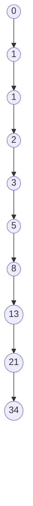

## Fibonacci Sequence

The Fibonacci sequence is a series of numbers where each number is the sum of the two preceding ones, usually starting with 0 and 1. It is named after the Italian mathematician Leonardo of Pisa, known as Fibonacci.

### Definition

Mathematically, the Fibonacci sequence is defined by the recurrence relation:

$$
F(n) = F(n-1) + F(n-2)
$$

with initial conditions:

$$
F(0) = 0, \quad F(1) = 1
$$

### Sequence

The beginning of the Fibonacci sequence is:

$$
0, 1, 1, 2, 3, 5, 8, 13, 21, 34, \ldots
$$

### Visualization

Below is a visual representation of the Fibonacci sequence using a graph diagram.

### Properties

1. **Golden Ratio**: The ratio of successive Fibonacci numbers approximates the golden ratio (approximately 1.61803398875), which can be expressed as:

$$
\phi = \frac{1 + \sqrt{5}}{2}
$$

2. **Applications**: The Fibonacci sequence appears in various natural phenomena, such as the branching of trees, arrangement of leaves on a stem, the fruit sprouts of a pineapple, and the flowering of an artichoke.

### Example Calculation

To calculate the 7th Fibonacci number using the recurrence relation:

$$
\begin{align*}
F(0) & = 0 \\
F(1) & = 1 \\
F(2) & = F(1) + F(0) = 1 + 0 = 1 \\
F(3) & = F(2) + F(1) = 1 + 1 = 2 \\
F(4) & = F(3) + F(2) = 2 + 1 = 3 \\
F(5) & = F(4) + F(3) = 3 + 2 = 5 \\
F(6) & = F(5) + F(4) = 5 + 3 = 8 \\
F(7) & = F(6) + F(5) = 8 + 5 = 13 \\
\end{align*}
$$

So, the 7th Fibonacci number is 13.

---

## Assignation

Write a class for Fibonacci numbers, this should include a method that will get the Nth number of the sequence. 

Solutions can be iterative or recursive (though recursive solutions are generally considered too slow and are mostly used as an exercise in recursion).

The sequence is sometimes extended into negative numbers by using a straightforward inverse of the positive definition:

$$
F(n) = F(n+2) - F(n+1) \iff n < 0
$$

Support for negative n in the solution is optional.